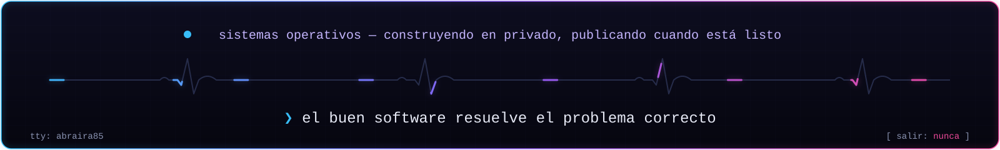

<p align="left"><a href="./README.md"></a><a href="./README.es.md"></a></p>
<p align="center"></p>

<p align="center">Trabajo donde se cruzan <strong>producto, ingeniería y operaciones</strong> — convirtiendo ideas de negocio, procesos internos y ambigüedad técnica en software útil y mantenible.</p>

## `~ ❯ docker compose ps`

Todo lo de abajo está en uso real, no es relleno de currículum.

```text
NAME       IMAGE                                      STATUS
frontend   typescript · react · next.js               Up (healthy)
api        node.js · nestjs · python · fastapi        Up (healthy)
data       postgresql · redis · elasticsearch         Up (healthy)
infra      docker · kubernetes · aws · gcp · actions  Up (healthy)
```

## `~ ❯ neofetch --avatar`

<table>
<tr>
<td width="30%" valign="top"></td>
<td width="70%" valign="top">
<br>
<strong>Rober de Ávila Abraira</strong><br>
<sub>tech lead e ingeniero full-stack</sub>
<br><br>
<code>OS</code>&nbsp;&nbsp;&nbsp;&nbsp;&nbsp;builder (Granada, España)<br>
<code>Host</code>&nbsp;&nbsp;&nbsp;outboss.io<br>
<code>Shell</code>&nbsp;&nbsp;zsh<br>
<code>Modos</code>&nbsp;arquitecto · builder · automator · lead<br>
<code>Sesión</code> laboratorio privado — activo
</td>
</tr>
</table>

## `~ ❯ tail -f /var/log/lab.log`

Un laboratorio privado de experimentos de IA y producto funciona en continuo. Los repos aparecen aquí solo cuando están limpios, documentados y merecen mostrarse.



<details>
<summary><code>~ ❯ cat notes/declassified.md</code></summary>

- **Software de negocio con IA** — explorando cómo LLMs, agentes y automatización mejoran las operaciones y reducen el trabajo manual.
- **Herramientas de desarrollo y plataformas internas** — patrones para construir aplicaciones de negocio más rápido sin perder mantenibilidad.

*Parte del trabajo permanece privado hasta que está lo bastante maduro para ser público.*

</details>

## `~ ❯ ls ~/public`

```text
ls: cannot access matching entries — el directorio está vacío por ahora
```

*Reservado para repositorios públicos — utilidades, casos de estudio y proyectos seleccionados, añadidos cuando estén limpios y merezca la pena mostrarlos.*

## `~ ❯ nmap outboss.io`

| PUERTO | SERVICIO | DESTINO | ESTADO |
|--------|----------|---------|--------|
| :443 | https    | [outboss.io](https://outboss.io) | abierto |
| :443 | linkedin | [linkedin.com/in/rober85](https://www.linkedin.com/in/rober85/) | abierto |
| :443 | cv       | [cv.pdf](./assets/cv-rober-de-avila-abraira.pdf) | abierto |
| :587 | smtp     | [rober@outboss.io](mailto:rober@outboss.io) | abierto |
| :443 | telegram | [t.me/rober85](https://t.me/rober85) | abierto |

<details>
<summary><code>~ ❯ man rober</code></summary>

```text
NOMBRE
    rober — tech lead e ingeniero full-stack
SINOPSIS
    rober [--architect] [--builder] [--automator] [--lead]
DESCRIPCIÓN
    Trabaja donde se cruzan producto, ingeniería y operaciones. Convierte
    ideas de negocio, procesos internos y ambigüedad técnica en software
    útil y mantenible.
OPCIONES
    --problema-real-primero   entender el problema antes de escribir código
    --arquitectura-simple     explícita, escalable, aburrida donde debe serlo
    --util-antes-que-listillo software en el que la gente confía, no demos
    --automatizar-con-palanca eliminar trabajo repetitivo donde compensa
    --claridad-de-equipo      mejores decisiones técnicas, entregadas
VÉASE TAMBIÉN
    outboss.io, linkedin(1), telegram(1)
```

</details>

<p align="center"></p>

<p align="center"><a href="https://outboss.io">outboss.io</a> · <a href="https://www.linkedin.com/in/rober85/">linkedin</a> · <a href="./assets/cv-rober-de-avila-abraira.pdf">cv</a> · <a href="mailto:rober@outboss.io">email</a> · <a href="https://t.me/rober85">telegram</a><br><sub>la sesión persiste — reconéctate cuando quieras</sub></p>
