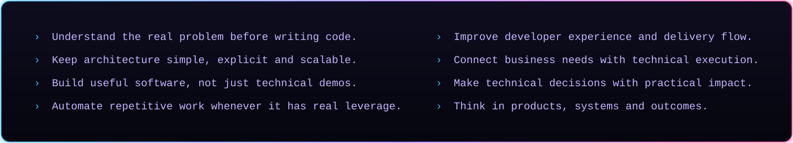
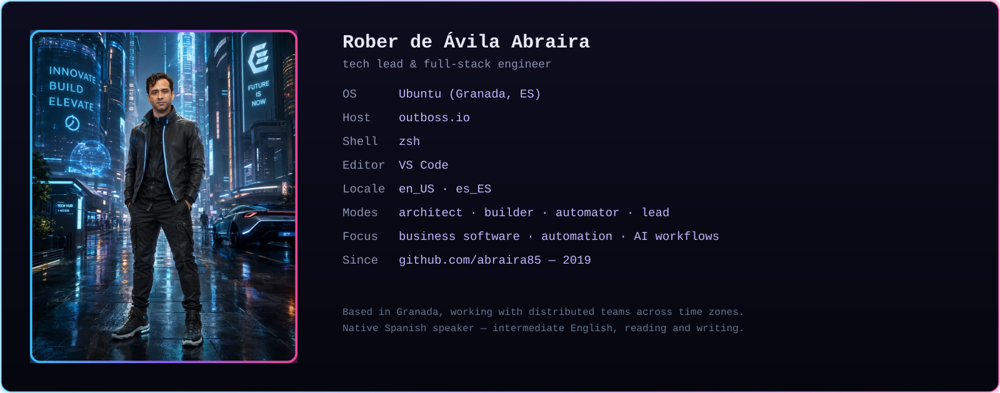
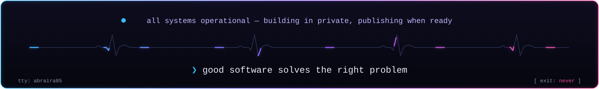

<p align="center"></p>

<p align="center">I work where <strong>product, engineering and operations</strong> meet — turning business ideas, internal processes and technical ambiguity into useful, maintainable software. Day to day that means moving across the full lifecycle: software architecture and system design, hands-on full-stack delivery, cloud infrastructure and automation, and the technical leadership that keeps a team shipping with clarity. I care less about which framework is trendy and more about whether what we build still makes sense to maintain a year from now.</p>

<p align="center"></p>

## `~ ❯ docker compose ps`

Everything below is in production use, not résumé filler.


## `~ ❯ neofetch --avatar`

<p align="center"></p>

## `~ ❯ tail -f /var/log/lab.log`

A private lab of AI and product experiments runs continuously. Repos surface here only when they are clean, documented and worth showing.



<details>
<summary><code>~ ❯ cat notes/declassified.md</code></summary>

- **AI-powered business software** — exploring how LLMs, agents and automation improve operations and reduce manual work.
- **Developer tools &amp; internal platforms** — patterns for building business applications faster without losing maintainability.

*Some work stays private until it is mature enough to be public.*

</details>

## `~ ❯ ls ~/public`

```text
ls: cannot access matching entries — directory is currently empty
```

*Reserved for public repositories — utilities, case studies and selected projects, added once they're clean and worth showing.*

## `~ ❯ nmap outboss.io`

| PORT | SERVICE  | ENDPOINT | STATE |
|------|----------|----------|-------|
| :443 | https    | [outboss.io](https://outboss.io) | open |
| :443 | linkedin | [linkedin.com/in/rober85](https://www.linkedin.com/in/rober85/) | open |
| :443 | resume   | [cv.pdf](./assets/cv-rober-de-avila-abraira.pdf) | open |
| :587 | smtp     | [rober@outboss.io](mailto:rober@outboss.io) | open |
| :443 | telegram | [t.me/rober85](https://t.me/rober85) | open |

<details>
<summary><code>~ ❯ man rober</code></summary>

```text
NAME
    rober — tech lead & full-stack engineer
SYNOPSIS
    rober [--architect] [--builder] [--automator] [--lead]
DESCRIPTION
    Works where product, engineering and operations meet. Turns business
    ideas, internal processes and technical ambiguity into useful,
    maintainable software.
OPTIONS
    --real-problem-first    understand the problem before writing code
    --simple-architecture   explicit, scalable, boring where it should be
    --useful-over-clever    software people rely on, not demos
    --automate-leverage     remove repetitive work where it pays off
    --team-clarity          better technical decisions, delivered
SEE ALSO
    outboss.io, linkedin(1), telegram(1)
```

</details>

<p align="center"></p>

<p align="center"><a href="https://outboss.io">outboss.io</a> · <a href="https://www.linkedin.com/in/rober85/">linkedin</a> · <a href="./assets/cv-rober-de-avila-abraira.pdf">cv</a> · <a href="mailto:rober@outboss.io">email</a> · <a href="https://t.me/rober85">telegram</a><br><sub>session persists — reconnect anytime</sub></p>
